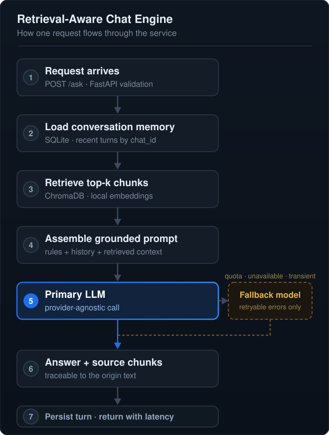

<h1>Dwij Desai</h1>

<strong>Backend · Applied AI · Retrieval Systems</strong>

---

I build backend and applied-AI systems in Python, where retrieval, APIs and deployment meet.

My focus is making language-model output **traceable** — answers you can tie back to the exact source text that produced them, rather than trust on faith.

<strong>B.Tech, Computer Science and Engineering</strong> 
Specialization: Big Data Analysis 
Ganpat University · 2023–2027 · 7th semester

 

## Retrieval-Aware Chat Engine

A retrieval-augmented generation backend, built as a running service rather than a notebook.

**What it does**

- **Ingests five formats** — PDF, TXT, CSV, XLSX, JSON — chunked into a persistent vector store
- **Embeds locally** with `bge-small-en-v1.5`, so document content never leaves the machine during indexing
- **Survives provider failure** — one abstraction layer over two LLM backends; quota and transient errors retry on a secondary model, while bad input and auth errors fail fast
- **Remembers the conversation** in SQLite, loaded *before* retrieval so follow-ups resolve against recent context
- **Stays traceable** — every chunk carries its source file and record index

Its README separates what is implemented, what is documented, and what I have personally validated.

 

## Other projects

<strong>Online Compiler Platform</strong> 
Browser-based interface for compiling and running code, with execution isolated in containers.

<strong>Course Recommendation System</strong> 
Similarity-based recommender — built the preprocessing pipeline and evaluated model performance.

 

## Experience

<strong>Software Engineering Intern</strong> — Biz App Dev 
<em>Jan – Jun 2024 · 6 months</em>

Built backend modules and REST API endpoints used by internal teams. Debugged and refactored application code to improve stability.

 

## Toolkit

Tools I've actually built with:

<strong>Coursework and exposure</strong>

 

<code>C++</code> · <code>Java</code> · <code>JavaScript</code> · <code>Angular</code> · <code>scikit-learn</code> · <code>PyTorch</code> · <code>Pandas</code> · <code>Hadoop</code> · <code>Apache Spark</code> · <code>MySQL</code>

Two tiers on purpose — I'd rather you trust the icons above than wonder about this list.

<strong>Certifications</strong>

 
<ul>
<li>Machine Learning Specialization — Andrew Ng, Coursera <em>(2025)</em></li>
<li>Python for Data Science — NPTEL <em>(2025)</em></li>
<li>Docker Essentials — LinkedIn Learning <em>(2025)</em></li>
<li>SQL Essential Training — LinkedIn Learning <em>(2024)</em></li>
<li>CCNA: Routing and Switching Essentials — Cisco <em>(2024)</em></li>
</ul>

---

<h3>Available from January 2027</h3>

Looking for a <strong>4–6 month backend / applied-AI internship</strong>

