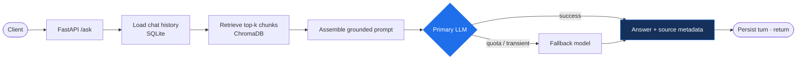

 

---

I build backend and applied-AI systems in Python — mostly at the point where retrieval, APIs and deployment meet. My current focus is making language-model output **traceable**: answers that can be tied back to the exact source text that produced them, rather than trusted on faith.

**B.Tech, Computer Science and Engineering** — Specialization: Big Data Analysis
Ganpat University, Institute of Computer Technology · 2023–2027 · currently 7th semester

 

## Featured — Retrieval-Aware Chat Engine

> A retrieval-augmented generation backend, built as a running service rather than a notebook.

**How one request flows through it**

|  | |
|:--|:--|
| **Ingestion** | Five document formats — PDF, TXT, CSV, XLSX, JSON — recursively chunked into a persistent vector store |
| **Embeddings** | `bge-small-en-v1.5` runs locally; document content never leaves the machine during indexing |
| **Resilience** | Provider abstraction across two LLM backends with error-classified fallback — quota and transient upstream failures retry against a secondary model, while malformed input and auth errors fail fast |
| **Memory** | Persistent multi-turn history in SQLite, loaded *before* retrieval so follow-up questions resolve against recent context |
| **Traceability** | Every retrieved chunk carries its source file and record index, so an answer can be tied to the text behind it |
| **Operations** | Multi-stage container build · pytest suite over ingestion behaviour and RAG-engine contracts · LangSmith tracing |

The repository README states component status explicitly — what is implemented, what is documented, and what I have personally validated are three different things, and it distinguishes them.

 

## Other projects

**Online Compiler Platform** — browser-based interface for compiling and running code, with execution isolated in containers. `React.js` `Docker` `REST API`

**Course Recommendation System** — similarity-based recommender; built the preprocessing pipeline and evaluated model performance. `Python` `Pandas` `scikit-learn`

 

## Experience

**Software Engineering Intern** — Biz App Dev · Jan – Jun 2024 *(6 months)*
Developed backend modules and REST API endpoints used by internal teams. Debugged and refactored application code to improve stability.

 

## Toolkit

**Working knowledge** — what I've built with

<b>Coursework and exposure</b> — smaller exercises, not work I'd claim production experience in

 

`C++` · `Java` · `JavaScript` · `Angular` · `scikit-learn` · `PyTorch` · `Pandas` · `Hadoop` · `Apache Spark` · `MySQL`

Two tiers on purpose. I'd rather you trust the first list than wonder about the second.

<b>Certifications</b>

 

- Machine Learning Specialization — Andrew Ng, Coursera *(2025)*
- Python for Data Science — NPTEL *(2025)*
- Docker Essentials — LinkedIn Learning *(2025)*
- SQL Essential Training — LinkedIn Learning *(2024)*
- CCNA: Routing and Switching Essentials — Cisco *(2024)*

 

 

---

### Available full-time from January 2027

Looking for a **4–6 month software / backend / applied-AI internship**.

